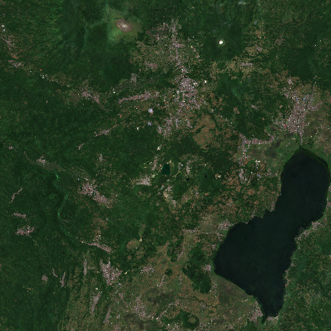

# Geothermal Model for Minahasa Compartment and Lahendong Geothermal Field

Here are meshes exported from ParaView and prepared for Blender project for Geothermal Model for Minahasa Compartment and Lahendong Geothermal Field on the North Arm of Sulawesi Island, Indonesia.
For the modeling we use GEBCO 2019/2020 Bathymetry and Landsat-8/Sentinel-2 Satellite images processed on Google Earth Engine.

## Blender project screenshots

## Landsat-8 and Sentinel-2 composite images previews

# Files

Blender project file:
  * [Minahasa.blend](Minahasa.blend)

Google Earth Engine (GEE) scripts to produce the Landsat-8 and Sentinel-2 composite images:
  * [GEE_COPERNICUS_S2_SR.js](GEE_COPERNICUS_S2_SR.js)
  * [GEE_LANDSAT_LC08_C01_T1_SR.js](GEE_LANDSAT_LC08_C01_T1_SR.js)

Landsat-8 and Sentinel-2 composite images:
  * [COPERNICUS_S2_Lahendong_50m_32651.tif](COPERNICUS_S2_Lahendong_50m_32651.tif)
  * [LANDSAT_LC08_Minahasa_150m_32651.tif](LANDSAT_LC08_Minahasa_150m_32651.tif)

ParaView and Blender compatible colored surfaces (.PLY) for Landsat-8 and Sentinel-2 composite images:
  * [COPERNICUS_S2_Lahendong_50m_32651.ply](COPERNICUS_S2_Lahendong_50m_32651.ply)
  * [LANDSAT_LC08_Minahasa_150m_32651.ply](LANDSAT_LC08_Minahasa_150m_32651.ply)

ParaView and Blender compatible colored surfaces (.PLY) for well temperatures:
   * [measuments_temp.ply](measuments_temp.ply)
   * [measuments_temp_large.ply](measuments_temp_large.ply)

ParaView and Blender compatible colored surfaces (.PLY) for models:
   * [GEBCO_2019.subset.32651.100m_gamma1.0km,2.0km.anomaly.ply](GEBCO_2019.subset.32651.100m_gamma1.0km,2.0km.anomaly.ply) - 3D inversion Lahendong model
   * [GEBCO_2020.subset.32651.500m_gamma5.0km,7.5km.density_raw.val70.ply](GEBCO_2020.subset.32651.500m_gamma5.0km,7.5km.density_raw.val70.ply) - 3D inversion Minahasa model (the major magma chambers only)

ParaView and Blender compatible not colored surfaces (.STL) for models:
  * [GEBCO12_47.stl](GEBCO12_47.stl) - Lahendong geothermal reservoir (productive)
  * [GEBCO12_4548.stl](GEBCO12_4548.stl) - buffer zone around Lahendong geothermal reservoir (not productive)

## References (see also local copies of the papers)

  * [Eben Ezer Siahaan and etc. «Tectonism and Volcanism Study in the Minahasa Compartment of the North Arm of Sulawesi Related to Lahendong Geothermal Field, Indonesia». Proceedings World Geothermal Congress 2005](https://pdfs.semanticscholar.org/0921/202ed144d74a7d28d6d3a815ab88c3eb9477.pdf)

  * [INVERSE MODELLING OF LAHENDONG GEOTHERMAL FIELD](https://www.researchgate.net/publication/311713901_INVERSE_MODELLING_OF_LAHENDONG_GEOTHERMAL_FIELD)

  * [NUMERICAL MODELLING OF LAHENDONG GEOTHERMAL SYSTEM, INDONESIA, Ahmad Yani, Pertamina](https://orkustofnun.is/gogn/unu-gtp-report/UNU-GTP-2006-24.pdf)
