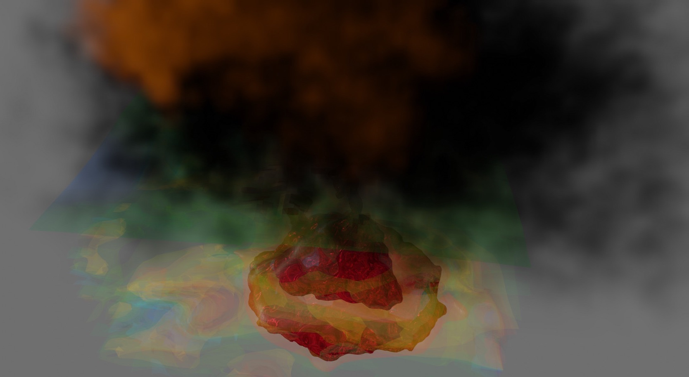

# ParaView-Blender

ParaView data post-processing with Blender 2.90.0 Beta. Stable Blender version 2.83.4 looks not usable with MantaFlow. See this article for details (ru): [Blender для (геофизического) моделирования и визуализации](https://habr.com/ru/post/515122/)

Click on picture below to watch YouTube videos:

