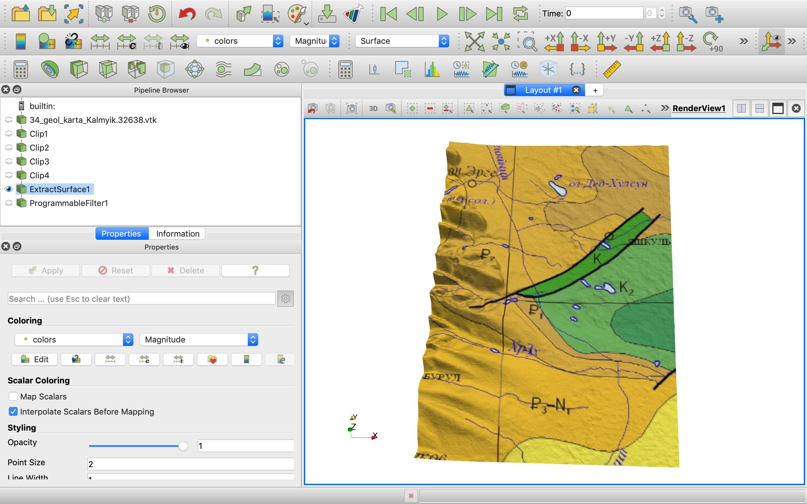
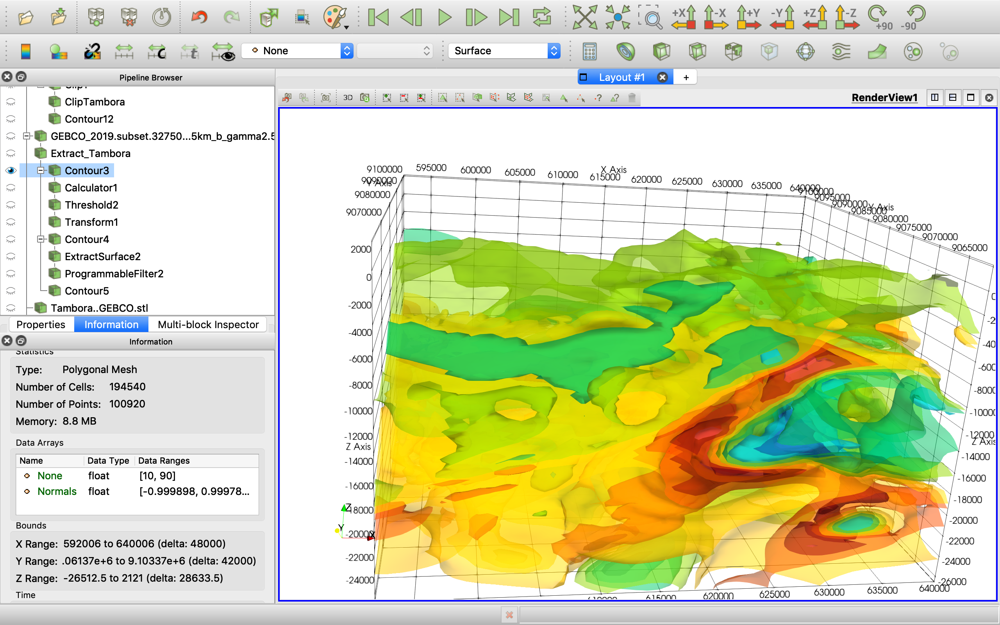

## ParaView Export DEM surface with RGB image on it as .PLY file

Unfortunately, there is ParaView bug with .PLY format export coloring and so it's not possible to just save .PLY file and open it in Blender. See for details [PLY export with color with Scalar](https://discourse.paraview.org/t/ply-export-with-color-with-scalar/1804/21)

* Use ParaView data source "NCubeImageOnTopographyBlockSource" from extension [N-Cube ParaView plugin for 3D/4D GIS Data Visualization](https://github.com/mobigroup/ParaView-plugins)
to load DEM with image on it into ParaView as "Unstructured Grid" data format surface.
* Use filter "ExtractSurface" to convert the surface to "Polygonal Mesh".
* Use this "ProgrammableFilter" to save the mesh to Blender-compatible .PLY file.
```
import vtk as VTK
input=self.GetPolyDataInput()
writer=VTK.vtkPLYWriter()

writer.SetInputData(input)
writer.SetFileName("34_geol_karta_Kalmyik.32638.ply")
writer.SetArrayName("colors")

writer.Write()
```
Note: "colors" variable name defined by N-Cube ParaView plugin.



## ParaView Export colored isosurfaces

Use export as PLY feature with "Enable Coloring" checkbox selected. The output file is not valid due to NaN coordinates and other issues in it. Use [MeshLab](https://www.meshlab.net/) software to import the ParaView output PLY and export the correct one.



## Blender export to Reality Converter

See the required software by this link: [AR Creation Tools](https://developer.apple.com/augmented-reality/tools/)

Export from Blender using glTF 2.0 format plus baked UV Images and convert them as
```
convert UVImage.png -evaluate Multiply 5 UVImage.2.png
usdzconvert /Users/mbg/torrent/Minahasa08.glb -diffuseColor UVImage.2.png
```
Here we need to increase exposure because there are no lighing sources in Reality Converter app.

Use this script to launch command-line "usdzconvert" tool from Apple "USDZ Tools" pack:
```
cat /usr/local/bin/usdzconvert

#!/bin/sh
# https://developer.apple.com/augmented-reality/tools/
export PATH="/Applications/usdpython/usdzconvert:$PATH"
export PYTHONPATH="/Applications/usdpython/USD/lib/python/:$PYTHONPATH"
usdzconvert "$@"
```
