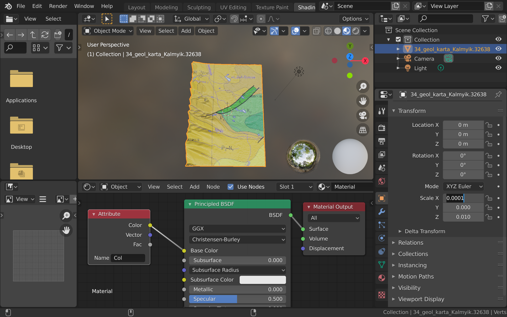

# Blender data import

See [ParaView data export](https://github.com/mobigroup/ParaView-Blender/tree/master/export) for details how to properly export data from ParaView.

## Import DEM surface with image on it as .PLY file

* Use File -> Import -> Stanford (.ply) to load the file.
* Use Object -> Set Origin -> Origin to Geometry to fill "Object Properties" tab.
* Set Location X,Y,Z to 0 and Scale X,Y to 1e-4 and Scale Z to 1e-2.

